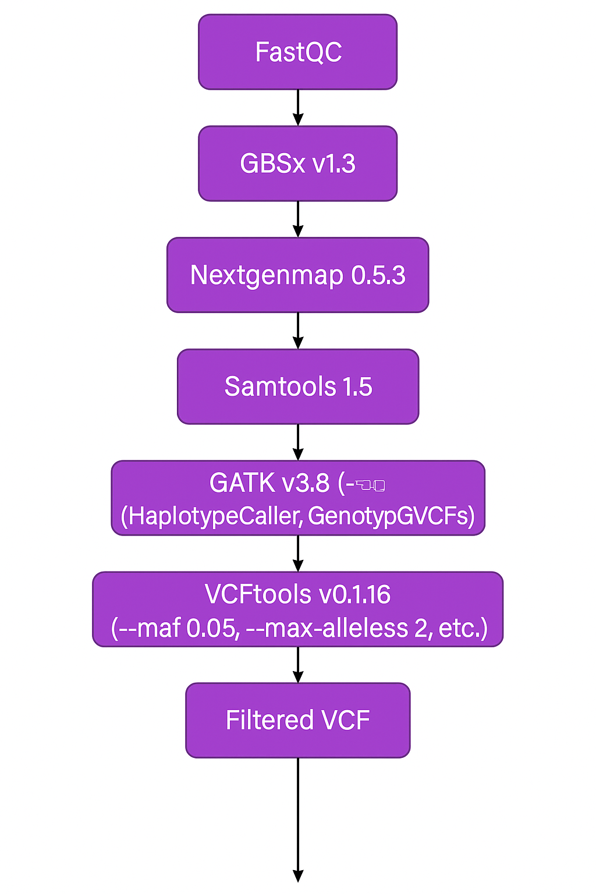
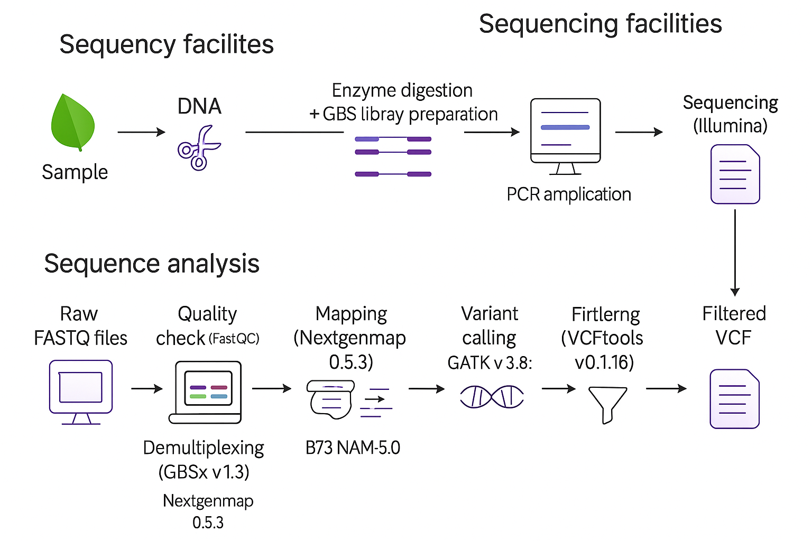

# 🧬 General SNP dataset

This folder contains the main SNP dataset used in the genomic analyses of the study:

**“Diversity and genetic structure within a Mexican maize race reveal consistent biocultural processes across geographic scales.”**

The dataset corresponds to the final filtered SNP matrix generated from genotyping-by-sequencing (GBS) data after variant calling and quality control.

---

## 📂 Directory structure

```markdown
📂 Directory structure
01_data_general_SNPs/
├── README.md                    # Documentation for this folder
├── mixplates_filtered_2x.vcf.gz # Final filtered SNP dataset in compressed VCF format
└── images/                      # Workflow images for the bioinformatic pipeline
    ├── pipeline1.png            # First section of the bioinformatic pipeline
    └── pipeline2.png            # Second section of the bioinformatic pipeline
```

---

## 📄 File description

| File | Description |
|---|---|
| `mixplates_filtered_2x.vcf.gz` | Final filtered SNP dataset generated from GBS data after variant calling and quality control. |
| `images/` | Folder containing workflow images that summarize the bioinformatic pipeline. |
| `README.md` | Documentation for this folder. |

---

## 🧪 Data generation summary

Raw sequencing reads were quality-checked with **FastQC** and demultiplexed using **GBSx v1.3**.

Reads were aligned to the *Zea mays* reference genome **B73, Zm-B73-REFERENCE-NAM-5.0** using **NextGenMap 0.5.3** and converted to BAM format with **SAMtools 1.5**.

Variant calling was performed using **GATK v3.8** with `HaplotypeCaller`, followed by joint genotyping with `GenotypeGVCFs`.

---

## 🔎 SNP filtering

SNPs were filtered according to the distribution of key variant-calling metrics using **VCFtools v0.1.16**.

The filtering parameters were:

`--maf 0.05
--max-alleles 2
--max-missing 0.80
--min-meanDP 0.5
--max-meanDP 4
--minDP 2
--maxDP 4
`

After filtering, **89,810 SNPs** were retained from **4,959,703 called variants**.

---

## 📦 Dataset format

The final SNP dataset is provided as a gzipped VCF file:

```text
mixplates_filtered_2x.vcf.gz
```

**Format:** gzipped Variant Call Format file (`.vcf.gz`)

---

## 🖼️ Bioinformatic pipeline

The bioinformatic workflow used to generate the final SNP dataset is summarized in the following figures.



**Figure 1.** First section of the bioinformatic pipeline used for read quality control, demultiplexing, alignment, and preprocessing.



**Figure 2.** Second section of the bioinformatic pipeline used for variant calling, joint genotyping, SNP filtering, and generation of the final VCF dataset.

---

## 📌 Notes

- The VCF file is compressed with `gzip`.
- This dataset is intended as the main genomic input for downstream analyses in the repository.
- Downstream analyses include PCA, ADMIXTURE, genetic diversity estimates, and supplementary genomic analyses.
- File names should be preserved to maintain compatibility with the scripts included in other folders of this repository.

---


